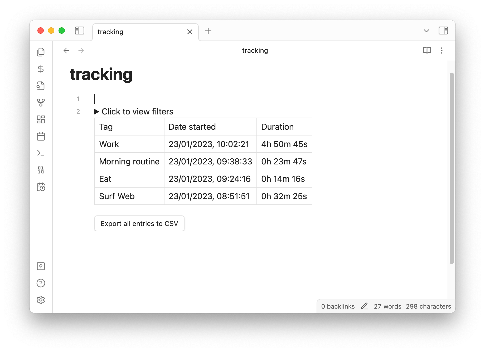
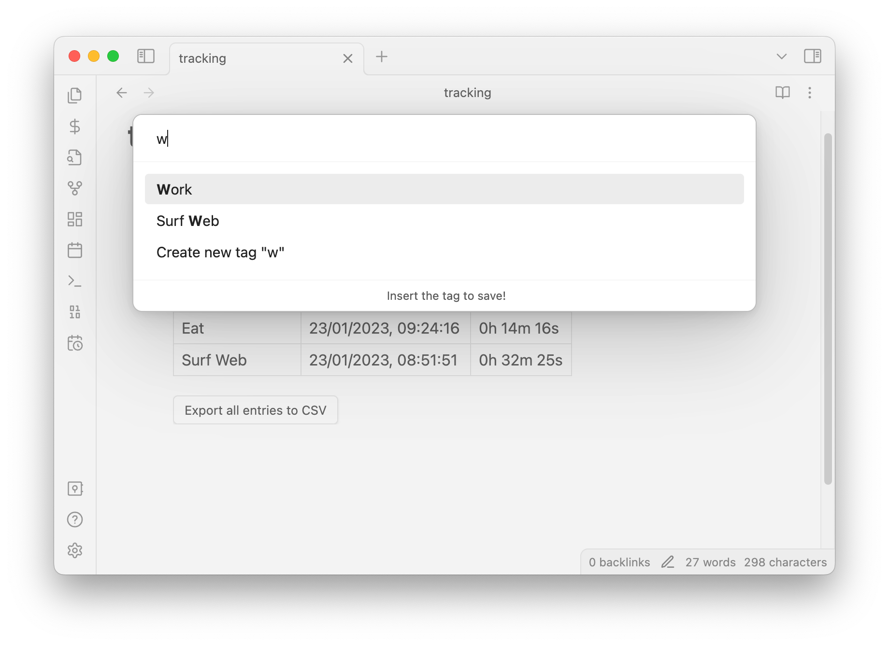
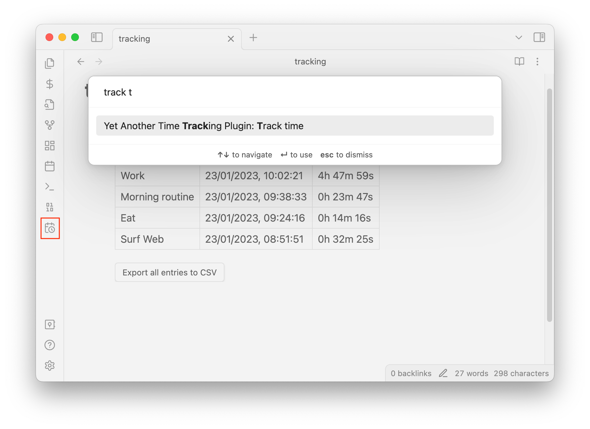

# Yet Another Time Tracking Plugin

This is simple time tracking plugin for Obsidian. The main focus of this plugin is to track time spent, without a lot of
friction. _A new entry can be added in less than 5 seconds_.

Entries are stored inside a markdown file and can be exported as CSV or as JSON.

Currently, the displayed table entries can be filtered only by date.



# How to install?

Download the latest version (`obsidian-yattp.zip`)
from [the release page](https://github.com/Paul-Gd/obsidian-yattp/releases) and unzip it in the plugin folder (
usually located at `/path-to-your-vault/.obsidian/plugins`).

# How to use?

You must first create a new `tracking` markdown file in the root directory. All the tags and timestamps will be stored
inside this file into a [code block](https://help.obsidian.md/How+to/Format+your+notes#Code+blocks) in `yattp`, as JSON.
The location of this file can be customized from plugin settings.

Click on the icon () on the left ribbon or press `⌘` + `p` and
type `track time` and start typing the tag for the activity that you start. You can either add a new tag or select from
existing tags:




`tracking.md` looks like this after 4 entries were added:

````
```yattp
[
  {
    "tag": "Surf Web",
    "date": "2023-01-23T06:51:51.078Z"
  },
  {
    "tag": "Eat",
    "date": "2023-01-23T07:24:16.486Z"
  },
  {
    "tag": "Morning routine",
    "date": "2023-01-23T07:38:33.311Z"
  },
  {
    "tag": "Work",
    "date": "2023-01-23T08:02:21.262Z"
  }
]
```
````

